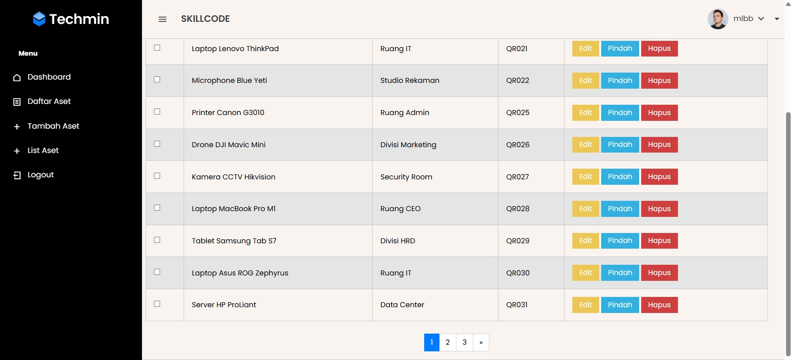

# Sistem Manajemen Aset Menggunakan Django Framework

Aplikasi web ini adalah sistem manajemen aset yang dibangun menggunakan framework Django dan terintegrasi dengan database Supabase. Aplikasi ini dibuat oleh **Danish Yusrah**.

**Kontak:**
* **Instagram:** [instagram.com/danish_yusrah](https://instagram.com/danish_yusrah)
* **Facebook:** [facebook.com/danishyusrah](https://facebook.com/danishyusrah)

Aplikasi ini memungkinkan pengelolaan aset, termasuk penambahan, pengeditan, pemindahan (mutasi), penghapusan, serta ekspor dan impor data aset dalam format Excel dan PDF.

## Fitur Utama

* **Manajemen Aset:**
    * Melihat daftar aset dengan fitur pencarian, filter (berdasarkan kategori dan lokasi), dan paginasi.
    * Melihat daftar aset milik pengguna tertentu (khusus untuk pengguna dengan peran 'user').
    * Menambah aset baru.
    * Mengedit informasi aset yang sudah ada.
    * Melakukan mutasi aset (pemindahan lokasi) dan mencatat riwayatnya.
    * Menghapus satu atau beberapa aset sekaligus (bulk delete).
    * Menghapus semua aset (fitur khusus admin).
    * Melihat riwayat mutasi untuk setiap aset.
* **Manajemen Pengguna dan Hak Akses:**
    * Autentikasi pengguna berbasis sesi (menggunakan *custom decorator*).
    * Pembatasan akses berdasarkan peran pengguna (admin dan user).
* **Dashboard:**
    * Tampilan dashboard yang berbeda untuk admin dan pengguna biasa.
* **Ekspor dan Impor Data:**
    * Ekspor daftar aset ke file Excel (`.xlsx`).
    * Ekspor daftar aset ke file PDF.
    * Impor data aset dari file Excel.
* **Integrasi dengan Supabase:**
    * Menggunakan Supabase REST API untuk berinteraksi dengan database Supabase.

## Teknologi yang Digunakan

* **Python:** Bahasa pemrograman utama.
* **Django:** Framework web tingkat tinggi berbasis Python.
* **Requests:** Library Python untuk melakukan HTTP request.
* **Pandas:** Library Python untuk analisis dan manipulasi data (khususnya untuk ekspor dan impor Excel).
* **Openpyxl:** Library Python untuk membaca dan menulis file Excel (`.xlsx`).
* **Reportlab:** Library Python untuk membuat file PDF.
* **Supabase:** Platform *Backend-as-a-Service* (BaaS) yang digunakan sebagai database.

## Instalasi

1.  **Clone Repository:**
    ```bash
    git clone https://github.com/danishyusrah/Sistem-Manajemen-Aset-Menggunakan-Django-Framework.git
    ```

2.  **Buat dan Aktifkan Virtual Environment (Disarankan):**
    ```bash
    python -m venv venv
    source venv/bin/activate  # Untuk Linux/macOS
    venv\Scripts\activate  # Untuk Windows
    ```

3.  **Install Dependencies:**
    ```bash
    pip install -r requirements.txt
    ```

4.  **Konfigurasi Supabase:**
    * Pastikan Anda memiliki akun Supabase dan proyek yang sudah dibuat.
    * Dapatkan URL proyek Supabase dan API Key (anon key).
    * Atur variabel lingkungan atau langsung ubah nilai `SUPABASE_URL` dan `SUPABASE_API_KEY` di file konfigurasi Django Anda (misalnya `settings.py`) atau langsung di file `views.py` (tidak disarankan untuk produksi).

5.  **Migrasi Database (Jika ada model Django yang digunakan):**
    ```bash
    python manage.py migrate
    ```

6.  **Jalankan Server Pengembangan:**
    ```bash
    python manage.py runserver
    ```

       Buka browser Anda dan akses `http://127.0.0.1:8000/`.

## Konfigurasi Tambahan

* **File Template:** Pastikan file-file template HTML berada di direktori yang sesuai dalam proyek Django Anda (misalnya di dalam folder `templates` di dalam setiap aplikasi).
* **Custom Decorator:** Pastikan file `utils/decorators.py` dengan dekorator `session_login_required` ada dan berfungsi dengan benar untuk menangani autentikasi berbasis sesi.
* **URL:** Pastikan URL di file `urls.py` proyek dan aplikasi Anda sudah dikonfigurasi dengan benar untuk mengakses *views* yang ada.

## `requirements.txt`

File `requirements.txt` berisi daftar *library* Python yang dibutuhkan oleh aplikasi ini:

# -Sistem-Manajemen-Aset-Menggunakan-Django-Framework
